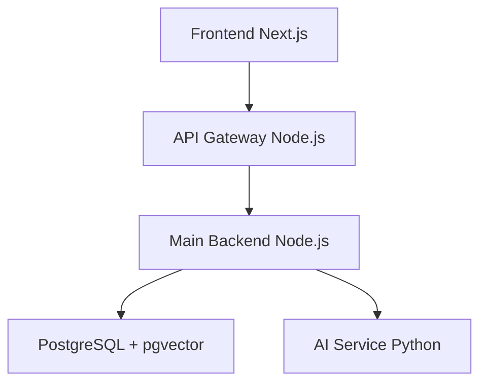

# Deep Knowledge AI Platform - Project Overview

## Purpose
Một nền tảng học tập thông minh được xây dựng trên kiến trúc microservices. Mục tiêu là cung cấp trải nghiệm học tập linh hoạt, cá nhân hóa, nơi người dùng có thể:
- Tạo ra các lộ trình học tập (mind map) từ một chủ đề bất kỳ
- Tương tác với AI để đào sâu kiến thức
- Ghi chú lại những gì đã học

## Architecture Overview

## Core Services
1. **Frontend** (`deep-knowledge-ai-platform`): Next.js với React, TypeScript, Tailwind CSS
2. **API Gateway** (`api-gateway`): Node.js routing và rate limiting
3. **Main Backend** (`backend-main`): Node.js business logic với TypeScript
4. **AI Service** (`langchain-python-service`): Python FastAPI với LangChain
5. **Database**: PostgreSQL với pgvector extension

## Technology Stack
- **Frontend**: Next.js 15, React, TypeScript, Tailwind CSS, Shadcn/UI, Radix UI
- **Backend**: Node.js, Express, TypeScript
- **AI Service**: Python, FastAPI, LangChain, OpenAI
- **Database**: PostgreSQL, pgvector
- **Authentication**: Supabase Auth
- **Deployment**: Docker, Docker Compose